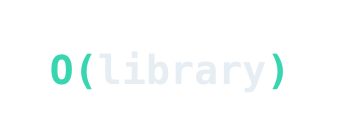

  

<h1 align="center">Big-O-Library</h1>

  
  
  

  
  
  

  Acervo colaborativo de materiais das disciplinas de Ciência da Computação.

## Sobre o projeto

O Big-O-Library reúne, em um só lugar, materiais de estudo das disciplinas do curso de Ciência da Computação, produzidos e organizados por alunos.

A ideia surgiu a partir da forma como o professor João Arthur organizou e disponibilizou o material de sua disciplina. O objetivo é levar esse modelo para as demais disciplinas do curso.

O projeto está no início, e o formato e o escopo do que será disponibilizado ainda estão em definição.

## Contribuição

Contribuições são bem-vindas. Se você já cursou alguma disciplina e quer compartilhar material, abra uma issue ou envie um Pull Request.

## Avisos

Este projeto é um material complementar produzido por estudantes e não substitui o conteúdo oficial, as aulas ou as orientações dos professores.

Sempre que possível, materiais de terceiros serão referenciados e vinculados à fonte original, respeitando suas licenças e direitos autorais.

## Status

Em desenvolvimento.

  Feito por alunos, para alunos.

