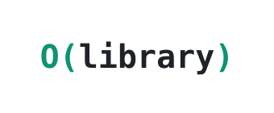

  <picture>
    <source media="(prefers-color-scheme: dark)" srcset="assets/images/bigo-library-dark.svg">
    <source media="(prefers-color-scheme: light)" srcset="assets/images/bigo-library-light.svg">
    
  </picture>

<h1 align="center">
  Big-O-Library
  
  
</h1>

  
  

  Acervo colaborativo de materiais das disciplinas de Ciência da Computação.

A ideia surgiu a partir da forma como o professor [João Arthur](https://github.com/joaoarthurbm) organizou e disponibilizou o material de sua disciplina. O objetivo é levar esse modelo para as demais disciplinas do curso.

## Conteúdo

O projeto está no início. Os materiais serão listados aqui à medida que forem adicionados.

## Contribuição

Contribuições são bem-vindas. Se você já cursou alguma disciplina e quer compartilhar material, abra uma [issue](https://github.com/thallesgsrv/Big-O-Library/issues) ou envie um Pull Request.

## Avisos

Este projeto é um material complementar produzido por estudantes e não substitui o conteúdo oficial, as aulas ou as orientações dos professores.

Sempre que possível, materiais de terceiros serão referenciados e vinculados à fonte original, respeitando suas licenças e direitos autorais.

## Status

Em desenvolvimento.

## Histórico de Estrelas

